<h1 align="center">An Inkling</h1>

<em>A life in the reef. First Beta Ediiton</em>

<strong><a href="https://avelaxonov.github.io/cuttlefish-game/">▶ Play in your browser</a></strong> 

  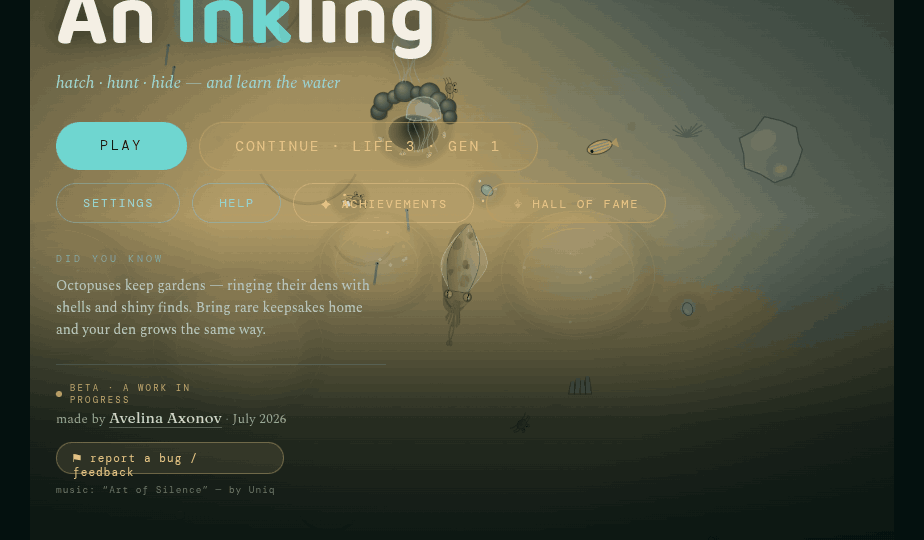

---

## About

You are a cuttlefish, hatched alone on a coral reef. You have a handful of months to live, 
and in that time you have to eat enough to grow,
stay unseen by everything that hunts, build a home, and, if lucky, leave a clutch of eggs.

Then you play your own heir. Hatchlings disperse on the current, the way real
ones do, so the heir wakes on an unfamiliar stretch of reef, but it carries
what the last life made of itself: the strength or the frailty your parent bred
into the line, and, at the far edge of the new map, the silted ruin of the den
you were born in, with your keepsakes still in it if you go and dig them out.

> **Hatch. Hunt. Hide. Hand it down.**

## Screenshots

###

The title screen is a live game running behind the type, so every load looks
different.

| | |
|---|---|
| 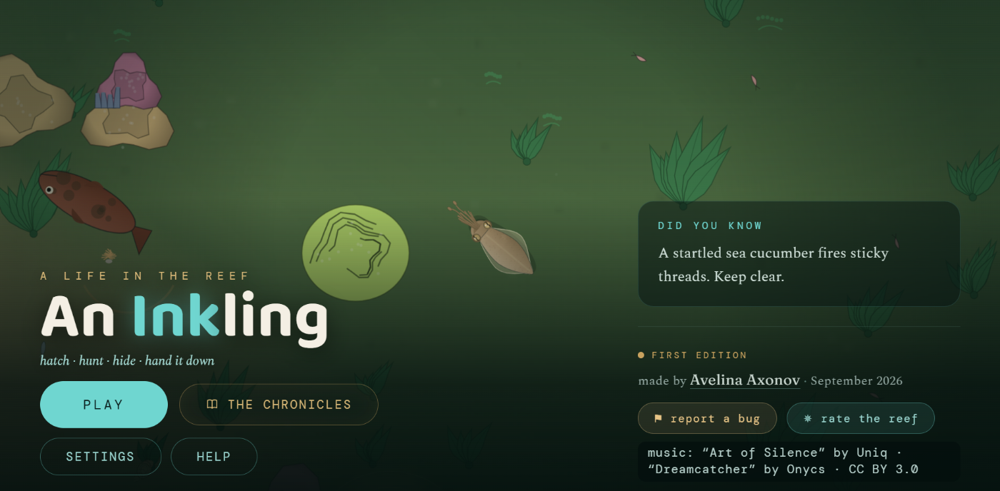  | 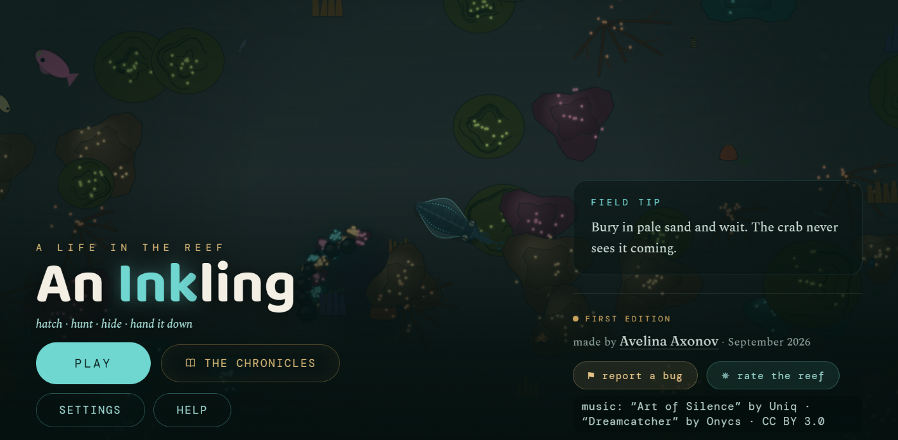 |

### The reef

| | |
|---|---|
| 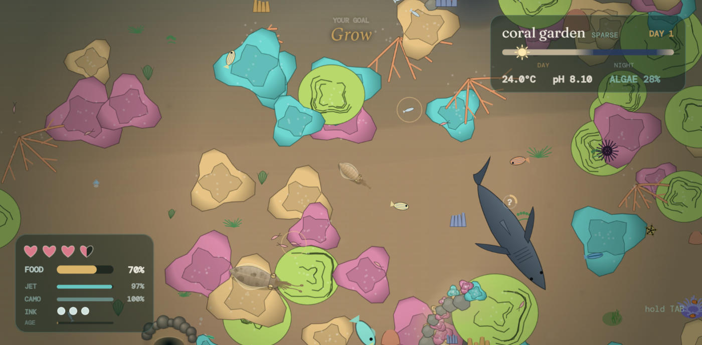 | 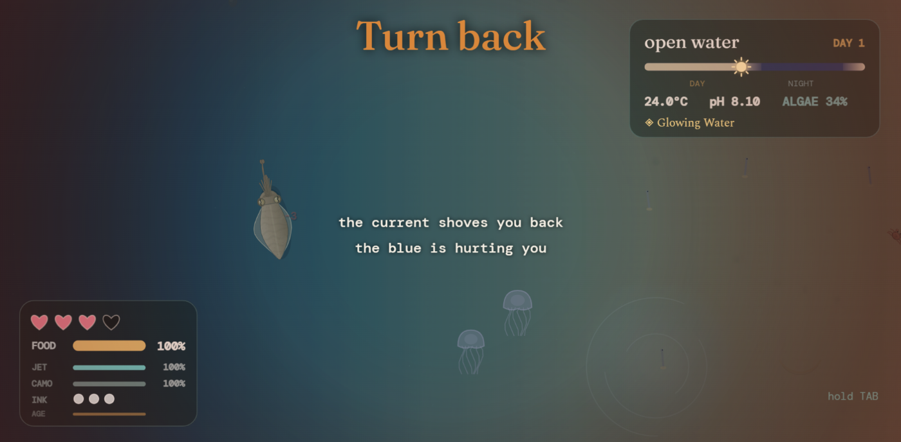 
| 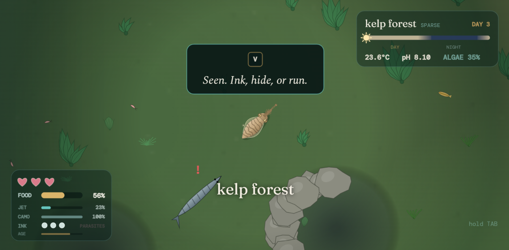 | 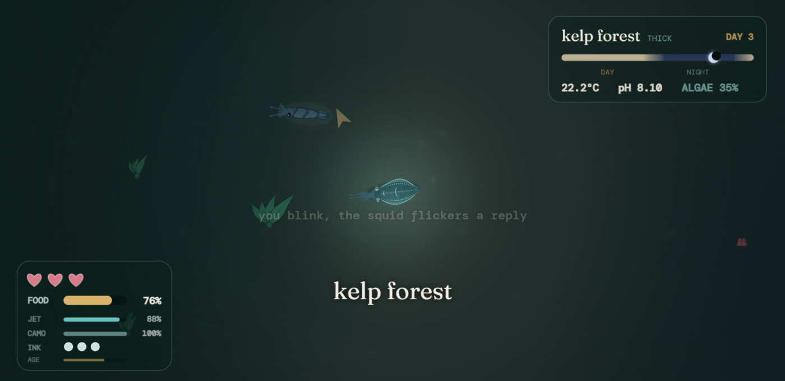 |

### Make a home, mate, & reproduce

| | |
|---|---|
| 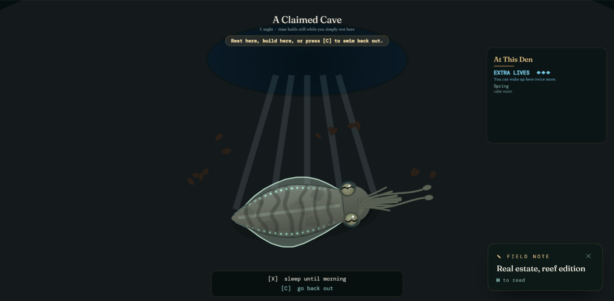 | 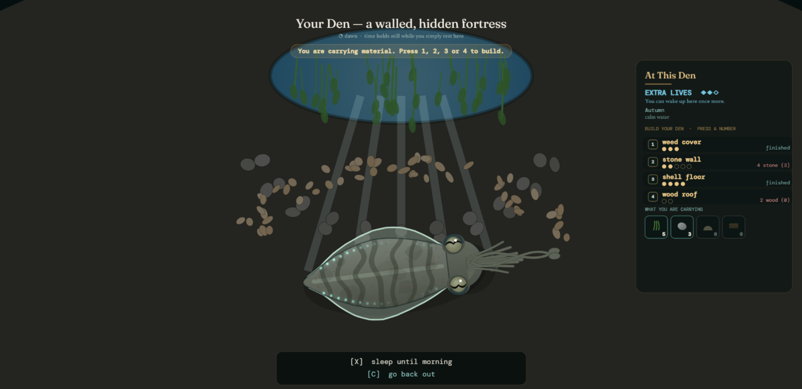 |
| 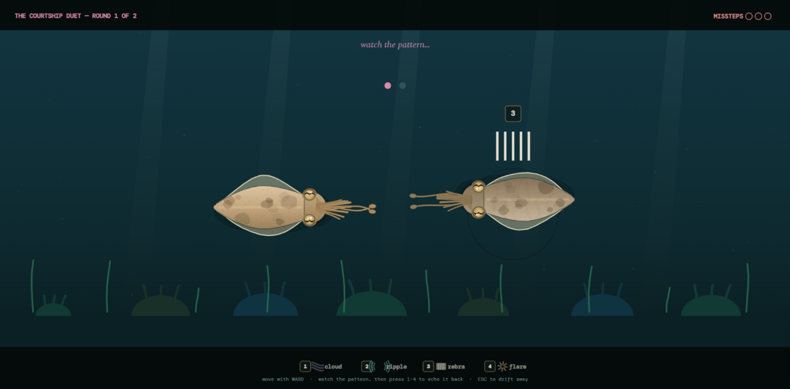 | 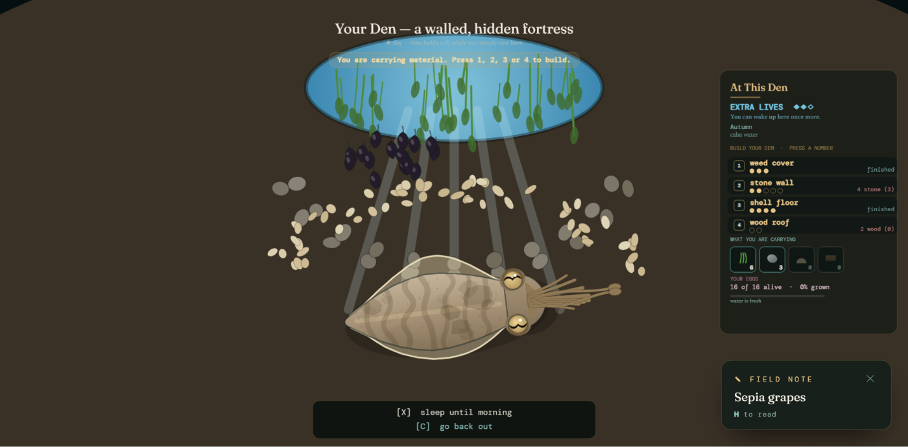 |

### Guises

Fourteen unique cephalopods "skins" to wear. Cosmetic only, earned through achievements completion.

| | |
|---|---|
|  |

### Map with tracking, help guide entries, chronicles, & other

| | |
|---|---|
| 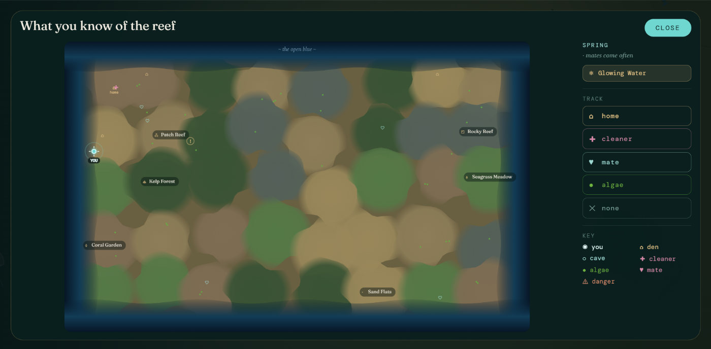 | 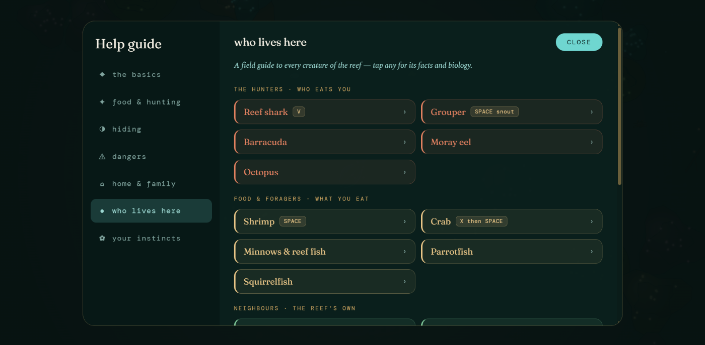 |
| 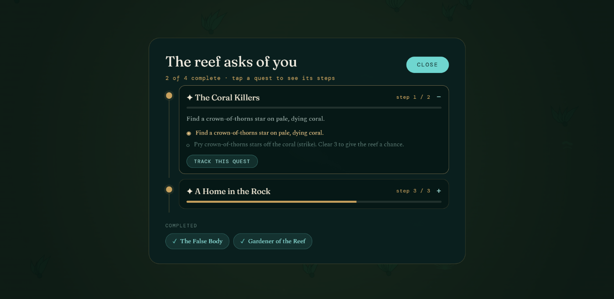 | 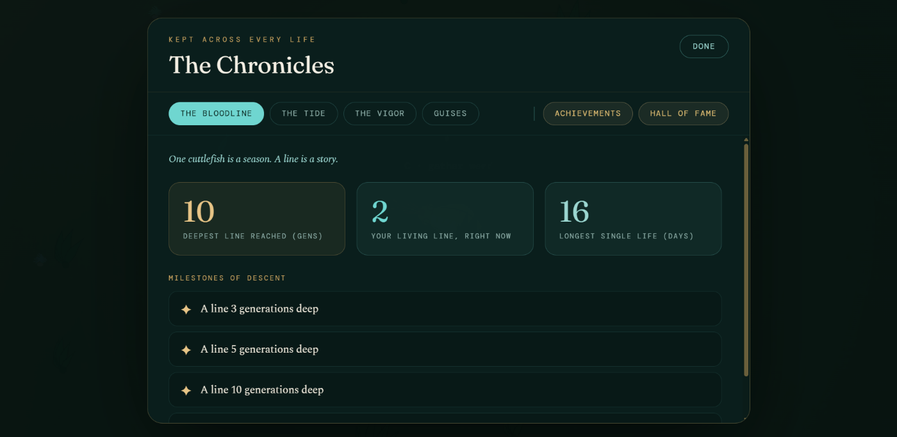 |

### On a phone

| | |
|---|---|
| 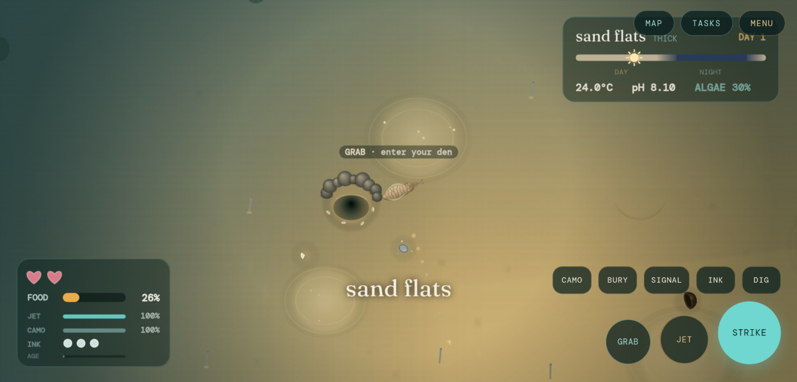 | 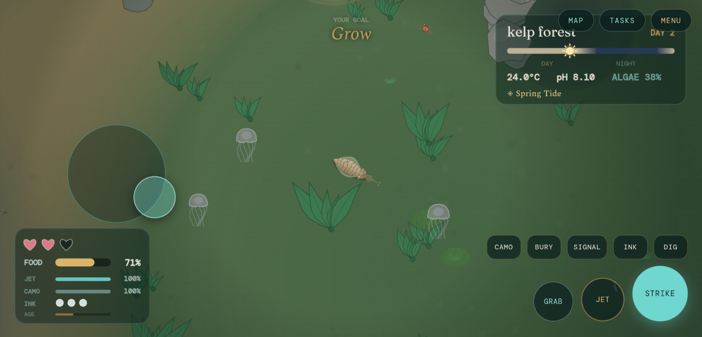 |

### THIS IS STILL BETA!

The in-game bug reporter copies its own diagnostics, and a short survey asks how
the reef actually feels to play.

| | |
|---|---|
| 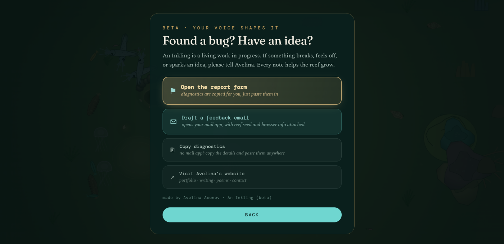 | 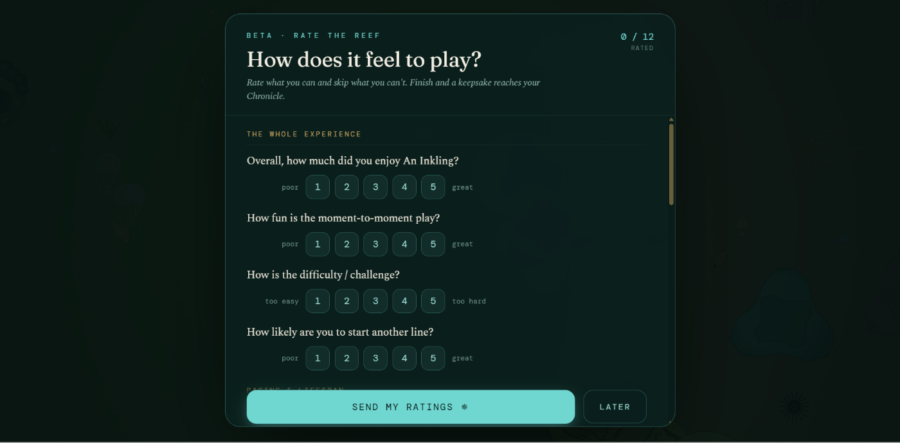 |

---

## Features

- **A reef that isn't the same twice**:
  - generated fresh each life from biome patches: seagrass meadow, sand flats, 
  rocky reef, kelp forest, patch reef, coral garden.
- **Sixty species with behavior**:
  - sharks patrolling & hunting, damselfish farming algae, cleaner stations, conches ploughing night sand, garden eels poking their heads, parrotfish sleeping in their mucus sacs and many more! 
- **Cuttlefish things**:
  - chromatophore camouflage, burying in sand to ambush, ink decoys, skin signal displays.
- **A home you make yourself**:
  - take a cave or dig your own den, then line it
  with seaweed, stone, shell and driftwood, and mount your rarest finds on the wall.
- **Legacy line**:
  - court, mate, lay, guard! generations later
  your heir can dig your keepsakes out of the birth-den ruin.
- **A reef that responds**:
  - temperature, pH and algal cover all move and all have consequences.
- **Things to find**:
  - 39 achievements plus 9 hidden, 14 guises, 13 tints of sea glass collectibles, 7 inherited instincts, 55 field observations (help guide entries).

---

## Controls

Laptop keys by default. Touch controls are a toggle in Settings.

| Key | |
|---|---|
| **WASD** | swim |
| **Space** *or* left-click | strike |
| **Shift** | jet |
| **E** *or* right-click | camouflage |
| **C** | grab / interact |
| **X** | bury in sand |
| **V** | release ink |
| **R** | skin-signal/bioluminescence |
| **B** | dig a den (hold) |
| **Q** · **M** · **I** · **H** | quests · map · inventory · help guide |
| **hold Tab** | full status report: vitals, water, tasks, controls |

**On a phone:** turn on touch controls in Settings and hold the phone sideways.
Touch anywhere on the left half to swim.

---

## Requirements

Any current browser. Nothing to install. Works in landscape on phones and
tablets.

---

## Interface & gameplay modes

- Four difficulty levels from *sheltered* to *harsh*.
- Life length from about 15
minutes to a whole evening.
- Three text sizes.
- Reduced visual effects.
- Separate music and effects volumes.
- Weather and disasters can each be switched off.
- Heredity from realistic to off.
- Every key rebindable.
- The tutorial can be skipped.

---

## On the biology

Field notes are generally following current science, and where the game takes a
liberty **the note would say so**.

Examples of some things that are **in-game only** features, not neccessarily true to real life:
- cuttlefish don't dig their own dens (octopuses are the diggers);
- they have no bioluminescence light organs;
- they can't carry all 12 stones, 12 seaweed leaves, 12 shells, and 6 driftwood at once, but in-game cuttlefish can

Corrections are ALWAYS welcome!

---

## Still to come

Held back from this edition: a prologue cutscene, passive communication with the shore, achievement-like charms, and some chain quests. Also under consideration: an installable offline version and possibly a Russian and Japanese translations.

---

## Credits

Made by **Avelina Axonov**. Begun July 2026; First Edition, September 2026.
Built with AI-assisted development (Claude, Anthropic), directed and playtested through every revision.

Music: *Art of Silence* by Uniq and *Dreamcatcher* by Onycs, CC BY 3.0.
