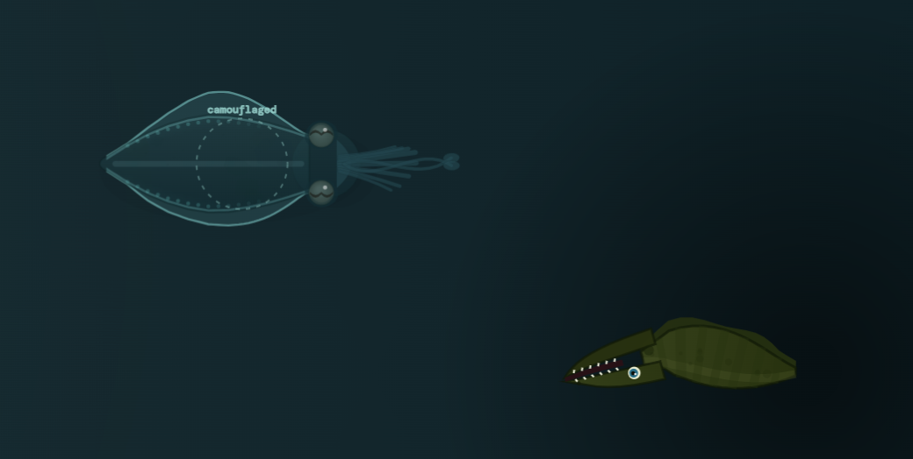
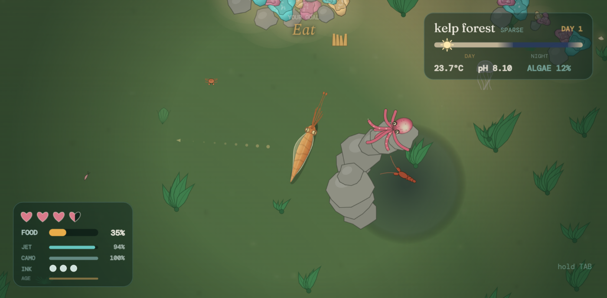
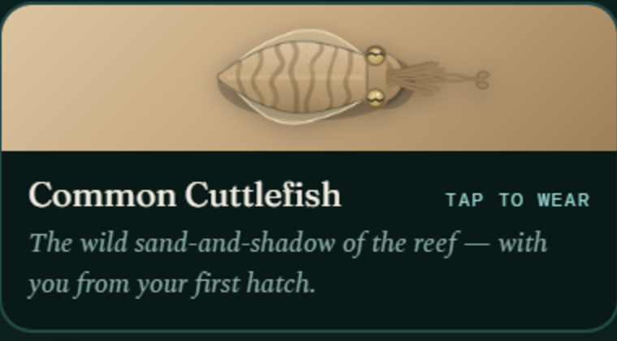
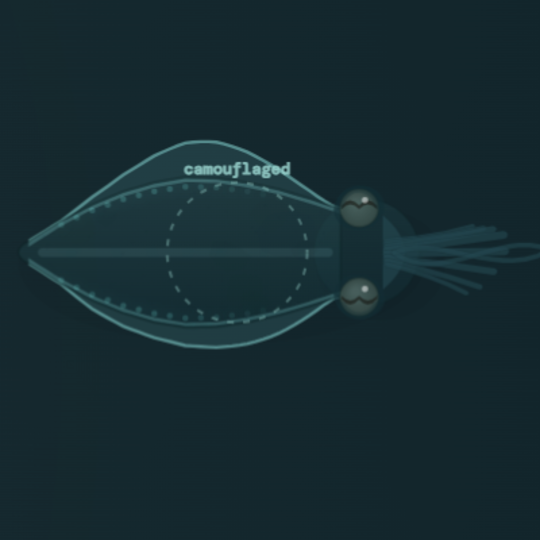

<h1 align="center">An Inkling</h1>

<em>A life in the reef.</em>

<strong><a href="https://avelaxonov.github.io/cuttlefish-game/">▶ Play in your browser</a></strong> — no download, no install

  

---

## About

You are one cuttlefish, hatched alone on a coral reef, roughly the size of a
thumbnail. Nothing is guarding you. You have a handful of months to live, which
is the truth about cuttlefish, and in that time you have to eat enough to grow,
stay unseen by everything that hunts, dig a home out of the sand, and if you
manage all of that, leave a clutch of eggs fastened to your own ceiling.

Then you play your own heir on the same reef, inheriting the water your parent
left behind — including the algae they never cleared and the strength they built
or spent.

> **Hatch. Hunt. Hide. Hand it down.**

Most lives end without a clutch. That is the honest version, and the game does
not hide it. It is a quiet, watchful game rather than a fast one. Camouflage
matters more than speed. Nothing here can be fought head-on and won.

---

## Why I made it

It began as an easter egg — a small cuttlefish hidden on my personal site, a
thing you could find if you poked at the page long enough. People kept finding
it, and I kept wanting it to have somewhere to swim to. I started building it
that reef in **July 2026**, and it stopped being an easter egg somewhere around
the second week.

What kept me going was the animal itself. A cuttlefish is colour-blind and still
the finest colourist in the ocean. Three hearts, W-shaped pupils, skin it thinks
with. It lives about a year, breeds once, and dies — and that is not a tragedy to
it, it is the shape of the life. I wanted a game where that shape was the design
rather than a failure state.

---

## Screenshots

### The reef

The title screen is a live game running behind the type, so every load looks
different.

| | |
|---|---|
|  |  |
|  |  |

### Mechanics

Camouflage beats speed. The verbs are the animal's: vanish, bury, ink, jet,
signal, grab, dig.

| | |
|---|---|
|  |  |
| Drink the colour and disappear — camouflage matches the actual ground beneath you. | Each hunter stalks and gives up differently. Ink leaves a decoy shaped like you. |
|  |  |
| Sixty-odd species, each with a job of its own. | Skin is a voice — signal, and the reef answers in light. |

### A home, a mate, a line

| | |
|---|---|
|  |  |
|  |  |

### Guises

Fourteen real cephalopods to wear — cuttlefish and squid, each with its own
body, fins, banding and palette. Cosmetic only, earned by achievement, and shown
to you the moment it unlocks. The rest are yours to find.

| | |
|---|---|
|  |  |
| The one you hatch as. | Any guise, camouflaged. |

### Map, bestiary, quests, Chronicles

| | |
|---|---|
|  |  |
|  |  |

### On a phone

| | |
|---|---|
|  |  |

### Still in beta

The in-game bug reporter copies its own diagnostics, and a short survey asks how
the reef actually feels to play.

| | |
|---|---|
|  |  |

---

## Features

- **A reef that isn't the same twice** — generated fresh each life from biome
  patches: seagrass meadow, sand flats, rocky reef, kelp forest, coral garden.
- **Sixty-odd species with real behaviour** — sharks hunting by electric field,
  damselfish farming algae, cleaner wrasses whose stations hold a truce even
  predators respect, conches ploughing night sand for buried clams.
- **Cuttlefish things, done properly** — chromatophore camouflage, burying in
  sand to ambush, pseudomorph ink decoys, the passing-cloud hypnosis display.
- **A home you dig yourself** — take a cave or hollow your own scrape; line it
  with weed, stone, shell and driftwood, and mount your rarest finds on the wall.
- **A line that remembers** — court in skin-light, lay, guard; generations later
  your heir can dig your keepsakes out of the birth-den ruin.
- **A reef that responds** — temperature, pH and algal cover all move and all
  have consequences.
- **Things to find** — 39 achievements plus 9 hidden, 14 guises, 13 tints of
  wave-worn sea glass, 7 inherited instincts, 55 field observations.

---

## Controls

Laptop keys by default. Touch controls are a toggle in Settings.

| Key | |
|---|---|
| **WASD** | swim |
| **Space** *or* left-click | strike |
| **Shift** | jet (hold) |
| **E** *or* right-click | hide |
| **C** | grab / interact |
| **X** | bury in sand |
| **B** | dig a den (hold) |
| **V** | ink |
| **R** | skin-signal |
| **Q** · **M** · **I** · **H** | tasks · map · carrying · field guide |
| **hold Tab** | full readout — vitals, water, tasks, every binding |

**On a phone:** turn on touch controls in Settings and hold the phone sideways.
Touch anywhere on the left half to swim — the stick appears under your thumb.

---

## Requirements

Any current browser. Nothing to install. Works in landscape on phones and
tablets. Sound is blocked until your first click, which is normal. Saves live in
your browser, tied to the address; there are four slots.

---

## Accessibility & options

Four difficulty levels from *sheltered* to *harsh*. Life length from about 15
minutes to a whole evening. Three text sizes. Reduced visual effects. Separate
music and effects volumes. Weather and disasters can each be switched off.
Heredity from realistic to off. Every key rebindable. The tutorial can be skipped.

---

## On the biology

Field notes are checked against current science, and where the game takes a
liberty **the note says so plainly**: cuttlefish don't dig their own dens
(octopuses are the diggers), they have no light organs, and they have no
planktonic larval stage. Everything else — the three hearts, the blue-green
blood, the colour-blind eye that makes the sea's finest colours — is real.
Corrections are welcome; open an issue.

---

## Still to come

Held back from this edition deliberately, and documented in
[ARCHIVE.md](ARCHIVE.md) with the exact line that switches each one back on: a
prologue, the Shore, charms, and two chain quests. Also on the list: an
installable offline version and possibly a Russian translation.

---

## Credits

Made by **Avelina Axonov**. Begun July 2026; First Edition, September 2026.

Written from scratch — no engine, no framework, no dependencies. One HTML file,
one runtime script, and a folder of sound. All rendering is hand-written canvas
drawing; every creature, plant and piece of coral is drawn in code.

Music: *Art of Silence* by Uniq and *Dreamcatcher* by Onycs, CC BY 3.0.
